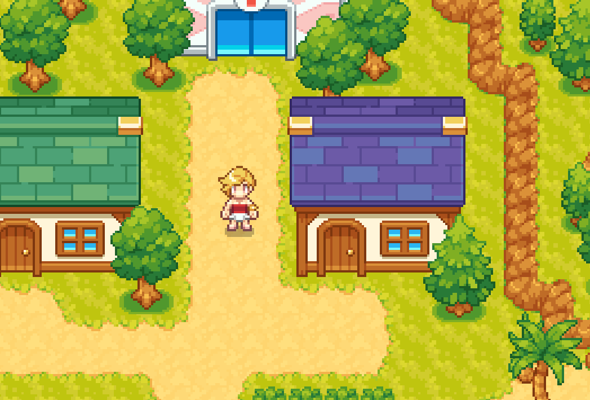
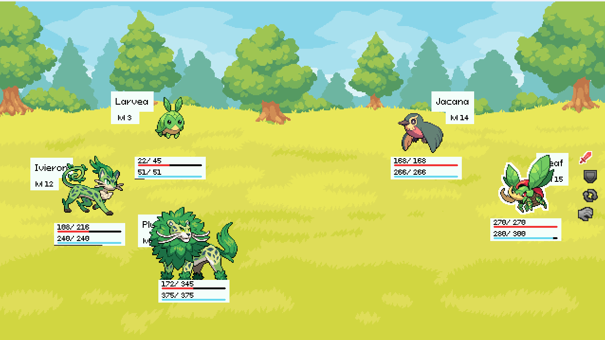
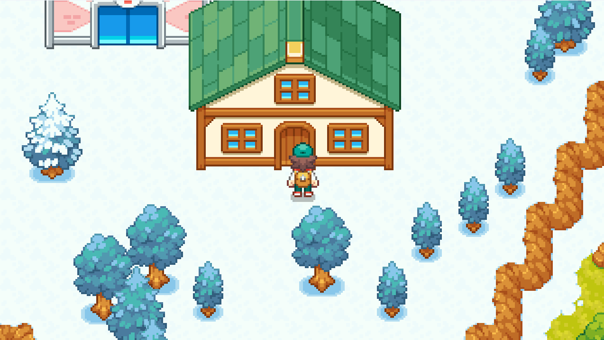
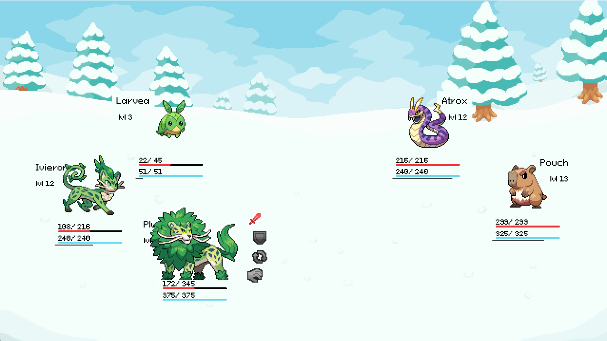
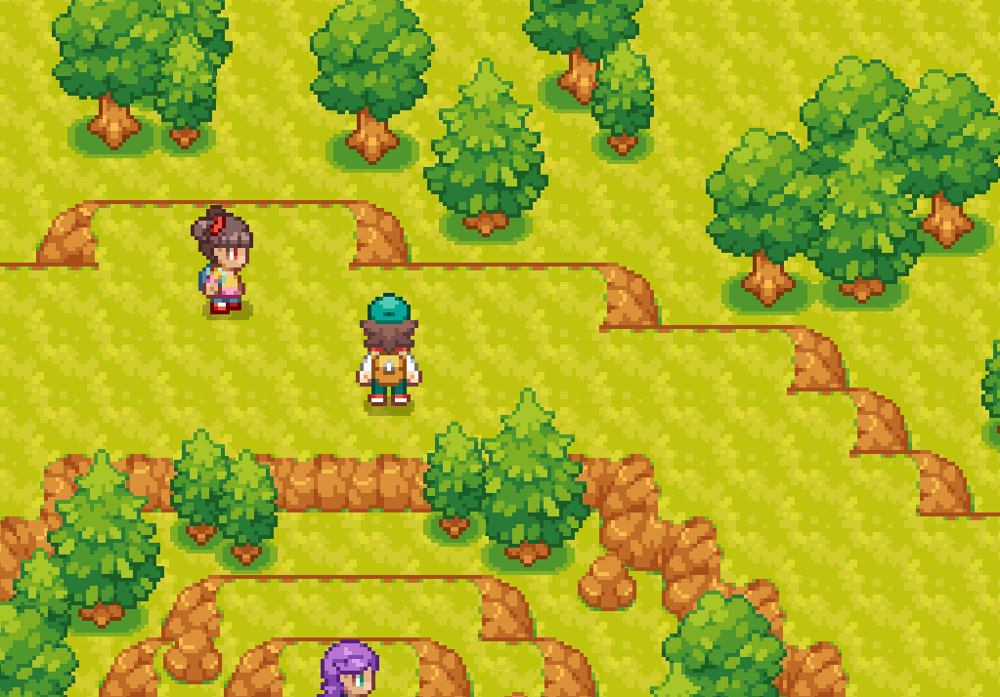
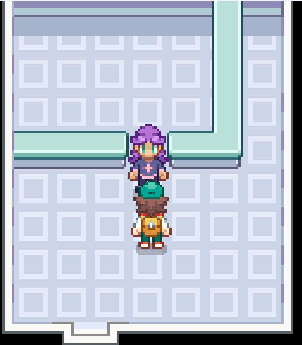

# Awesome Pokemon

A top down open world RPG fighting game inspired by Pokemon.

## How to Play

Download from the GitHub release page

## Images

## Places to Explore

- The Desert
- Snow Land
- Fire Arena
- Water Arena
- Plant Arena

## Features

- Game Saving
- NPCs
- Battles
- Arenas
- Leveling Up
- Monsters
- Encounter System

## Controls

- **WASD** or **Arrow Keys**: Move
- **Space**: Interact
- **ESC**: Pause
- **Enter**: Open Index

For more instructions, see the in game guide.

---

*Art assets from a free art pack* 

